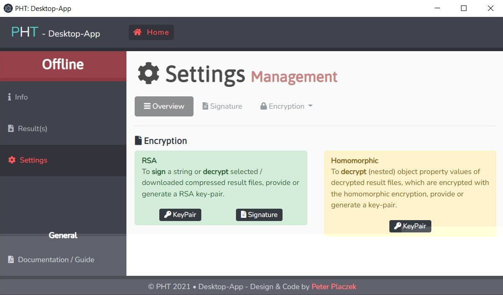

[](https://github.com/PHT-Medic/desktop-app/actions/workflows/main.yml)

# Desktop App 🖥
This repository contains the desktop app of the Personal Health Train.



**Table of Contents**

- [Installation](#installation)
- [Usage](#usage)
  - [Development](#development)
  - [Build](#build)
- [License](#license)

## Installation
This application uses `yarn` as node dependency manager.

``` bash
yarn install
```
## Usage

### Build

``` bash
# build application for production
yarn run build

```

### Development

``` bash
# serve application with hot reloading 🔥
yarn run dev
```

## License

Made with 💚

Published under [MIT License](./LICENSE).
